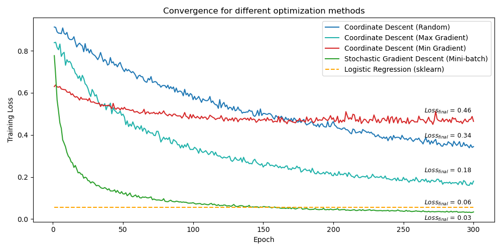
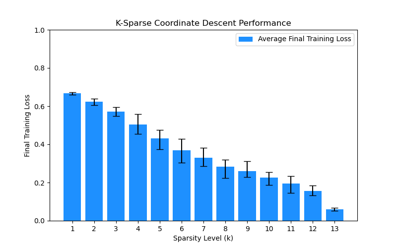

# Comparison of optimization strategies: Coordinate Descent, Stochastic Gradient Descent, and L-BFGS

Coordinate descent is an optimization technique that updates one parameter at a time. This report explores its variations and compares their convergence with stochastic gradient descent (SGD) and L-BFGS on a logistic regression task using the Wine dataset. We implement coordinate descent strategies based on random, steepest, and shallowest gradient selection, finding that the steepest gradient selection improves convergence while the shallowest often stagnates. SGD outperforms both coordinate descent and L-BFGS, achieving the lowest final training loss. We also analyze k-sparse coordinate descent, which enforces sparsity by limiting the number of nonzero parameters. Higher sparsity increases variability in loss, with overly aggressive pruning leading to suboptimal convergence. Our findings emphasize that while coordinate descent is effective, its performance depends on the update strategy, and SGD remains the most efficient method for this task.

| **Optimization Method**             | **Final Loss**     |
|------------------------------------|--------------------|
| Sklearn (L-BFGS)                   | 0.0570 ↑   |
| CD (Random Selection)\*            | 0.3445             |
| CD (Max Gradient Selection)        | 0.1849 ↑ |
| CD (Min Gradient Selection)        | 0.4644 ↓     |
| SGD (Mini-batch)                   | **0.0340** ↑ |

Final Training Loss Comparison for Different Optimization Methods. *Random selection is the baseline. Arrows depict relative improvement or degradation w.r.t this baseline

Convergence comparison of different optimization methods over 300 epochs. Coordinate Descent with maximum gradient selection performs better than random selection but does not reach the benchmark. Coordinate Descent with minimum gradient selection stagnates and fails to improve significantly. Stochastic Gradient Descent (SGD) achieves the lowest final training loss, outperforming `sklearn`'s L-BFGS solver.

K-Sparse Coordinate Descent Performance: Final training loss across different sparsity levels (\( k \)). Error bars indicate the min-max range of loss values. All values are computed over 20 iterations at each sparsity level.

Final Training Loss for Different Sparsity Levels in Coordinate Descent

| **Sparsity Level (k)** | **Final Training Loss** |
|------------------------|--------------------------|
| 1                      | 0.6684                   |
| 2                      | 0.6237                   |
| 3                      | 0.5702                   |
| 4                      | 0.5037                   |
| 5                      | 0.4320                   |
| 6                      | 0.3693                   |
| 7                      | 0.3298                   |
| 8                      | 0.2843                   |
| 9                      | 0.2595                   |
| 10                     | 0.2270                   |
| 11                     | 0.1944                   |
| 12                     | 0.1563                   |
| **Full-model**         | **0.0588**               |
